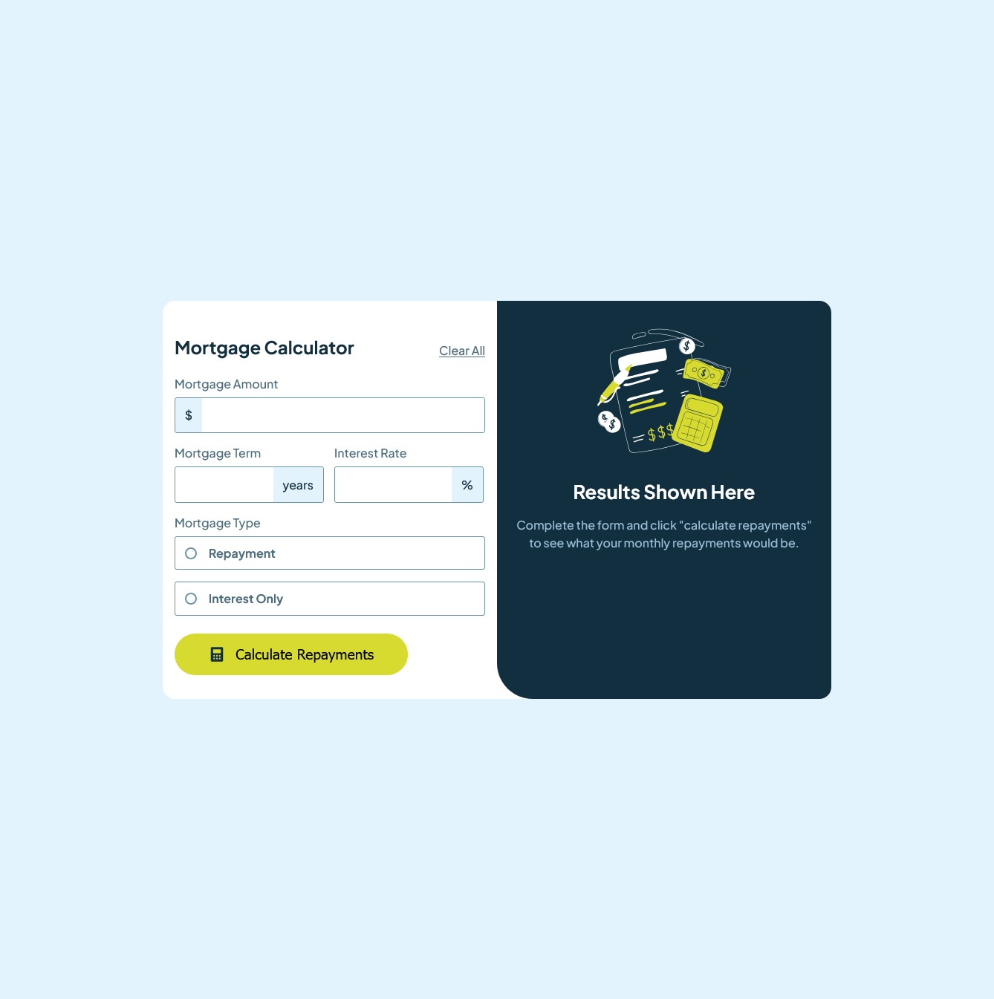

# Frontend Mentor - Mortgage repayment calculator solution

This is a solution to the [Mortgage repayment calculator challenge on Frontend Mentor](https://www.frontendmentor.io/challenges/mortgage-repayment-calculator-Galx1LXK73). Frontend Mentor challenges help you improve your coding skills by building realistic projects. 

## Table of contents

- [Overview](#overview)
  - [The challenge](#the-challenge)
  - [Screenshot](#screenshot)
  - [Links](#links)
- [My process](#my-process)
  - [Built with](#built-with)
  - [What I learned](#what-i-learned)
  - [Continued development](#continued-development)
- [Author](#author)

## Overview

### The challenge

Users should be able to:

- Input mortgage information and see monthly repayment and total repayment amounts after submitting the form
- See form validation messages if any field is incomplete
- Complete the form only using their keyboard
- View the optimal layout for the interface depending on their device's screen size
- See hover and focus states for all interactive elements on the page

### Screenshot



### Links
- Live Site URL: [Live Site](https://mortgagecalculaor.netlify.app/)

### Built with

- Semantic HTML5 markup
- CSS custom properties
- Flexbox
- Mobile-first workflow

### What I learned
I learned about browsers being picky about colors when it comes to accent-color.  This is supposed to be for accessability, but browsers have strange behavior when it doesn't like the color you chose.  So my radio buttons had to be custom styled to use the expected color.  I also learned about complex selectors, where a selector checks on a child element, and then can be styled


```css
.input-container:has(input:focus) {
    border: 1px solid var(--accent-color);
}
.input-container:has(input:focus) > span {
    background-color: var(--accent-color);
}
```

### Continued development

This challenge was harder than it looked from the project description.  I was surprised that the JavaScript part was relatively easy compared to all the CSS issues that I ran into.  I think I need better up front planning when doing my markup.  There were a few cases where more thought out structure could have prevented some headaches.  Also, I feel I should focus on smaller pieces at a time, rather than jumping around trying to get it all working at the same time.


## Author
- Frontend Mentor - [@djmills89](https://www.frontendmentor.io/profile/djmills89)


